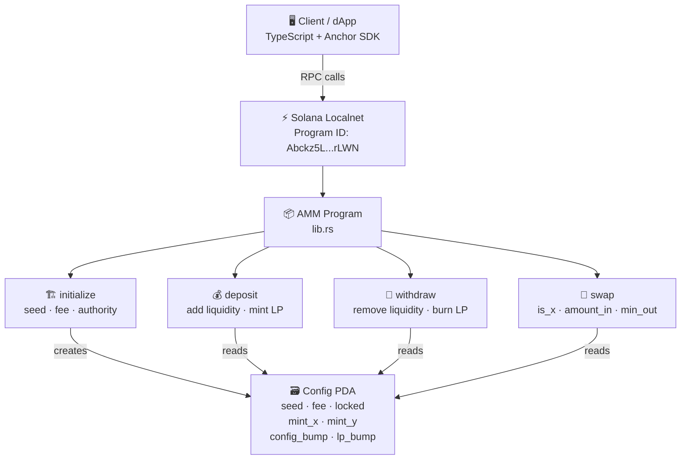
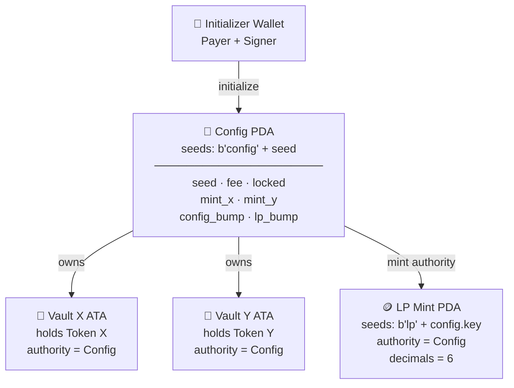
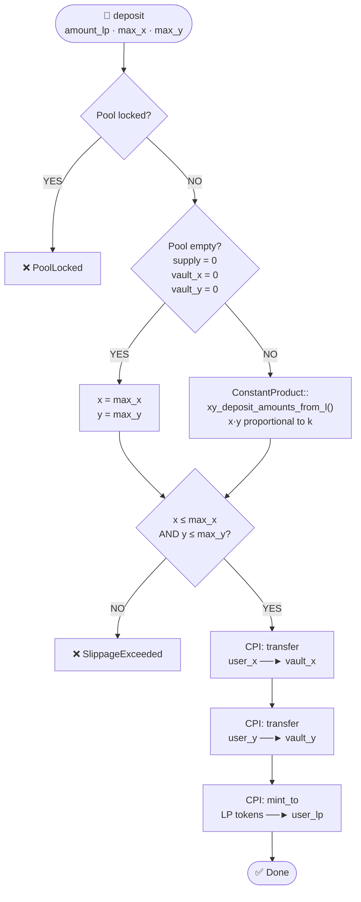
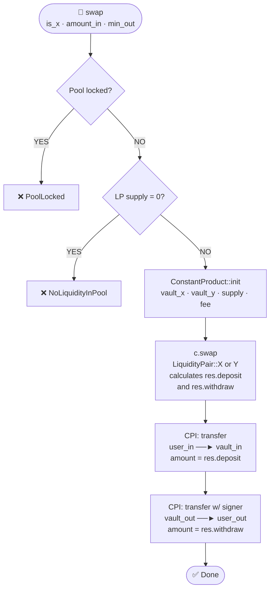
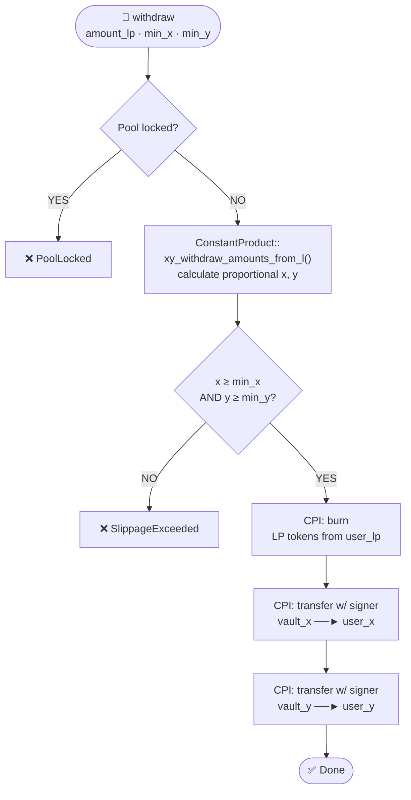
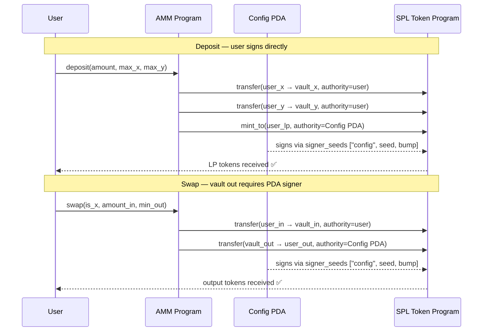

# ⚓ Anchor AMM — Solana Automated Market Maker

A decentralized **Automated Market Maker (AMM)** built on Solana using the [Anchor framework](https://www.anchor-lang.com/). Implements a constant-product curve (`x * y = k`) for trustless token swaps, liquidity provisioning, and LP token management — fully on-chain.

---

## 📐 Architecture Overview



---

## 🏦 On-Chain Account Structure



---

## 💰 Deposit Flow



---

## 🔄 Swap Flow



---

## 🏧 Withdraw Flow



---

## 🔁 CPI & PDA Signer Pattern



---

## 📁 Project Structure

```
anchor-amm/
├── Anchor.toml                  # Workspace config, cluster, wallet
├── Cargo.toml                   # Workspace root
├── package.json                 # Anchor SDK, Mocha, Chai
├── tsconfig.json                # TypeScript config for tests
├── rust-toolchain.toml          # Pinned Rust 1.89.0
│
├── migrations/
│   └── deploy.ts                # Anchor deploy script
│
├── programs/amm/src/
│   ├── lib.rs                   # Entrypoint — routes all 4 instructions
│   ├── constants.rs             # Program-wide constants
│   ├── error.rs                 # Custom AmmError codes
│   │
│   ├── instructions/
│   │   ├── initialize.rs        # Pool init — Config PDA + vaults + LP mint
│   │   ├── deposit.rs           # Add liquidity, mint LP tokens
│   │   ├── withdraw.rs          # Remove liquidity, burn LP tokens
│   │   └── swap.rs              # Token swap via constant product curve
│   │
│   └── state/
│       └── config.rs            # Config account definition
│
└── tests/
    └── amm.ts                   # Integration tests (Mocha + Anchor)
```

---

## 🛠️ Instructions

### `initialize(seed, fee, authority)`
| Account | Role |
|---|---|
| `initializer` | Payer + signer |
| `mint_x / mint_y` | The two tokens forming the pair |
| `config` | PDA — central pool state |
| `mint_lp` | PDA — LP token mint (authority = config) |
| `vault_x / vault_y` | ATAs holding pool reserves |

### `deposit(amount, max_x, max_y)`
| Param | Description |
|---|---|
| `amount` | LP tokens to mint |
| `max_x` | Max Token X to deposit (slippage guard) |
| `max_y` | Max Token Y to deposit (slippage guard) |

### `withdraw(amount, min_x, min_y)`
| Param | Description |
|---|---|
| `amount` | LP tokens to burn |
| `min_x` | Min Token X expected back (slippage guard) |
| `min_y` | Min Token Y expected back (slippage guard) |

### `swap(is_x, amount_in, min_amount_out)`
| Param | Description |
|---|---|
| `is_x` | `true` = sell Token X, `false` = sell Token Y |
| `amount_in` | Amount of input token to sell |
| `min_amount_out` | Minimum output expected (slippage guard) |

---

## 🔐 Config Account

```rust
pub struct Config {
    pub seed: u64,                 // Unique pool identifier
    pub authority: Option<Pubkey>, // Optional admin (can lock pool)
    pub mint_x: Pubkey,            // Token X mint address
    pub mint_y: Pubkey,            // Token Y mint address
    pub fee: u16,                  // Swap fee in basis points (30 = 0.3%)
    pub locked: bool,              // Emergency lock flag
    pub config_bump: u8,           // PDA bump for config
    pub lp_bump: u8,               // PDA bump for LP mint
}
```

---

## 🧩 Core Concepts

**Constant Product Curve (`x * y = k`)** — The invariant governing all swaps and liquidity ops. The `constant-product-curve` crate handles all math — deposit ratios, swap output amounts, and fees.

**Config PDA** — Central pool account derived from a `seed`. Multiple independent pools can coexist by using different seeds.

**LP Tokens** — Minted to liquidity providers proportional to their pool share. Burning LP tokens returns the underlying assets.

**Slippage Protection** — Every instruction takes a min/max bound. If the pool ratio moves beyond tolerance, the transaction reverts.

**PDA Vault Authority** — Both vaults are ATAs owned by Config PDA. The program signs outgoing transfers using `CpiContext::new_with_signer` with seeds `["config", seed, bump]` — no private key needed.

---

## 🚀 Getting Started

### Prerequisites
- [Rust](https://www.rust-lang.org/tools/install) — pinned to `1.89.0`
- [Solana CLI](https://docs.solana.com/cli/install-solana-cli-tools)
- [Anchor CLI](https://www.anchor-lang.com/docs/installation) `v0.32.1`
- [Yarn](https://yarnpkg.com/)

```bash
git clone https://github.com/Subodhkd001/anchor-amm.git
cd anchor-amm
yarn install
anchor build
anchor test
```

---

## 🧪 Tech Stack

| Layer | Technology |
|---|---|
| Smart Contract | Rust + Anchor `0.32.1` |
| Curve Math | `constant-product-curve` |
| Token Standard | SPL Token (`anchor-spl`) |
| Tests | TypeScript + Mocha + Chai |
| Network | Solana Localnet |

---

## 📝 License

ISC
